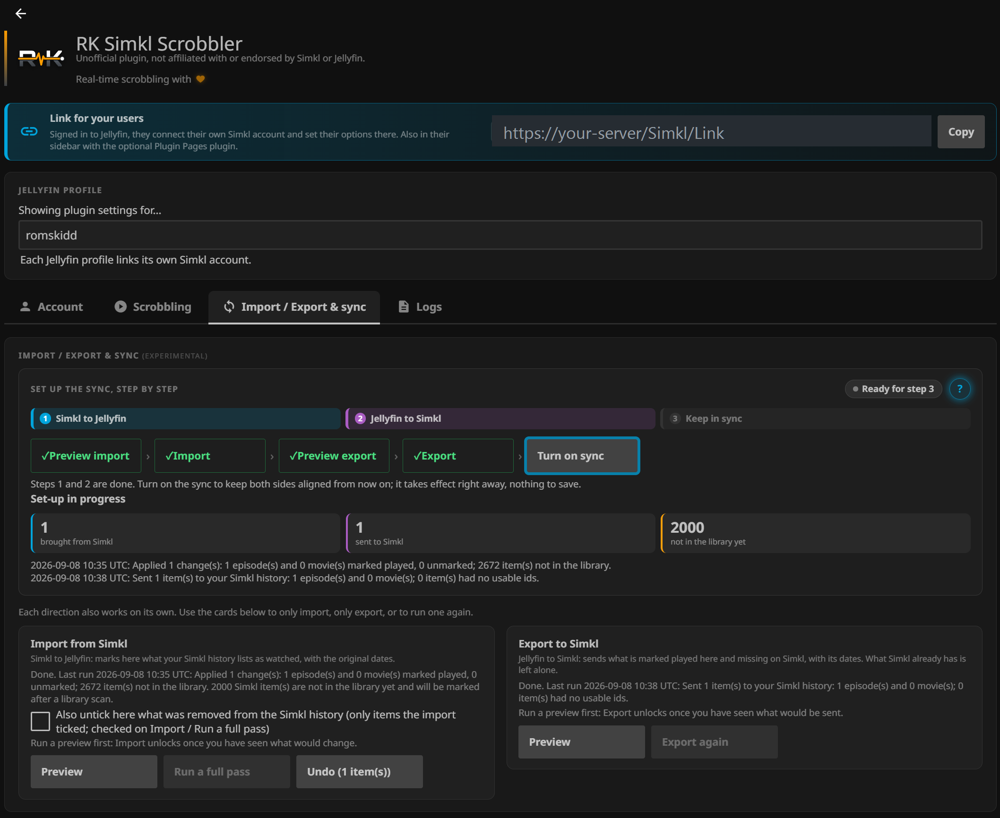

<p align="center"></p>
<p align="center">
  <a href="https://github.com/romskidd/jellyfin-plugin-simkl-scrobbler/releases/latest"></a>
  <a href="https://github.com/romskidd/jellyfin-plugin-simkl-scrobbler/releases"></a>
  
  <a href="LICENSE"></a>
</p>
<p align="center"><em>Unofficial plugin, not affiliated with or endorsed by Simkl or Jellyfin. Simkl and Jellyfin are trademarks of their respective owners; this is an independent community project.</em></p>

What you watch in Jellyfin shows up on [Simkl](https://simkl.com) as you watch it: the
title appears in your "Watching now" banner the moment playback starts, pauses are
tracked, and the item is marked watched once you stop past 80%. Manual check marks,
rewatches and per-user settings are covered too. Each Jellyfin user links their own
Simkl account.

## Why this one

The official [Simkl plugin](https://github.com/jellyfin/jellyfin-plugin-simkl) is
maintained and scrobbles in real time since its version 9. This fork exists for what it
does not cover:

- **Users link their own Simkl account themselves.** The official plugin already keeps a
  separate Simkl login per Jellyfin profile, but only an administrator can set each one up
  from the dashboard. Here every user has an **RK Simkl Scrobbler** entry in their own
  menu and links their own account from there, with their own settings — no dashboard
  access, nothing else to install.
- **The history syncs both ways.** Bring a Simkl history into a fresh Jellyfin library,
  send what Jellyfin already knows to Simkl, or keep the two aligned from then on — with
  a preview before every write and a 7-day undo. *(Requested upstream in
  [#22](https://github.com/jellyfin/jellyfin-plugin-simkl/issues/22) and
  [#31](https://github.com/jellyfin/jellyfin-plugin-simkl/issues/31).)*
- **It runs on Jellyfin 10.11.x and on 12.0.** The official version 9 targets 12.0 only.

Plus rewatch sessions, per-user library exclusions, and a Logs tab that builds a
diagnostic report with no tokens in it.

## What it looks like

<p align="center"></p>

The **Import / Export & sync** tab: the guided box walks through the three steps, each
button unlocking once the previous one has run, and the counters report what each pass
did. Below it, the Import and Export cards let either direction run on its own.

## Installation

1. In Jellyfin: **Dashboard → Plugins → Repositories → Add**, with this URL:

   ```
   https://raw.githubusercontent.com/romskidd/jellyfin-plugin-simkl-scrobbler/master/manifest.json
   ```
2. Open the **Catalog** tab, install **RK Simkl Scrobbler**, and restart Jellyfin.
3. The plugin appears in the dashboard sidebar, under the plugins section.

**Beta channel.** Beta builds are published through a separate repository, so they
never reach servers on the URL above. To try them, add this URL instead (or as well;
Jellyfin then offers the newest version of the two):

```
https://raw.githubusercontent.com/romskidd/jellyfin-plugin-simkl-scrobbler/master/manifest-beta.json
```

The beta channel currently carries the same build as the stable one; it is where the
next round of changes will appear first.

Runs on Jellyfin 10.11.x and on Jellyfin 12. A free Simkl account is enough; rewatch tracking needs
Simkl Pro or VIP, as Simkl only offers it there.

## Linking a Simkl account

- **Administrators**: open the plugin page in the dashboard, pick a Jellyfin profile,
  click **Log In**, enter the code at simkl.com/pin. The page updates on its own once
  Simkl accepts the code.
- **Everyone else**: every user finds an **RK Simkl Scrobbler** entry in their own
  menu (the avatar menu on Jellyfin 12, the side drawer on 10.11), leading to a
  self-service page where they link their own account and set their options. No
  dashboard access, nothing else to install. The administrator can also share the
  page's link, shown on the plugin page, and can turn the menu entry off there.

Each profile keeps its own Simkl login and settings.

## Features

**Scrobbling**
- Real-time `start` / `pause` / `stop` events, so titles appear in your live
  "Watching now" banner and paused positions follow you across Simkl-connected devices
- Marked watched when you stop past 80% (decided by Simkl, per its scrobble guide)
- Events are sent only on real player actions, never on a timer
- Items that Simkl can't match by IMDb/TMDb/TVDB ids are matched by filename

**Marking and rewatches**
- Ticking an episode, a season or a movie as played in Jellyfin adds it to your
  Simkl history in one batched request; unticking can remove it (off by default)
- **Rewatches** (Simkl Pro / VIP): finishing something you had already watched is
  filed by Simkl as a rewatch session, and later episodes of the same show join it.
  Off by default. The plugin only offers a stop as a rewatch when at least half of
  the item played in that session, so resuming near the end never counts; Simkl
  applies its own rules on top (item already watched, two days between viewings)

**Simkl sync** (off by default)
- Set up in three steps from the **Import / Export & sync** tab, guided by a status box (each button unlocks after the previous one): **1. Simkl to Jellyfin** marks
  as played what your Simkl history lists (watch date and play count included, only
  items present in your libraries), **2. Jellyfin to Simkl** sends what Jellyfin has
  as played and Simkl doesn't have yet, **3. Keep in sync** then follows the Simkl
  history after each playback and library scan, at most once an hour
- Every step shows a preview before anything is written; both directions can be
  undone for 7 days; a pass that would change more than 200 items waits for your
  confirmation; excluded libraries are left alone; anime is not covered
- Items Simkl lists that Jellyfin can't match are counted and retried after each
  library scan
- Each linked profile sets it up on its own page (admin page or self-service page)

**Per user**
- Movies and shows on or off, minimum runtime filter
- Library exclusions, to keep home videos or kids' content off Simkl
- Watch statistics, the last scrobble with an **Open on Simkl** link, and the last
  rewatch, on both the admin page and the self-service page

**Reliability**
- A stop that Simkl doesn't confirm is queued and replayed for up to 24 hours, so a
  network blip on the final event doesn't lose an episode
- Finished watches are kept while a Simkl link is expired and sent once the account
  is linked again (up to 30 days)
- A **Logs** tab on the admin page builds a diagnostic report (versions, a settings
  summary without tokens, the plugin's recent log lines) to paste into a bug report
- An expired or rejected Simkl login is detected at startup and reported as
  "Link expired" instead of looking connected while nothing scrobbles
- Requests follow Simkl's API guidelines: one write per second per user, settings
  and statistics re-read only when Simkl reports a change, PIN status polled at the
  interval Simkl asks for

## Upgrade notes

> [!NOTE]
> **9.7.0.0** brings the Simkl sync to the stable channel, and one build now covers both
> Jellyfin 10.11.x and Jellyfin 12. The sync stays off until you set it up, and the
> scrobbling side is unchanged. Please report anything odd in the
> [issues](https://github.com/romskidd/jellyfin-plugin-simkl-scrobbler/issues), with the
> report from the **Logs** tab.

> [!IMPORTANT]
> **Coming from 9.3.0.0 or earlier?** Since 9.4.0.0 the plugin runs as its own Simkl
> application, and Simkl tokens are bound to the application that issued them. Every
> user has to **link their Simkl account again, once**. The plugin shows "Link expired"
> with the usual PIN button; all settings are kept.

> [!NOTE]
> **Renamed in 9.5.0.0.** "Simkl Scrobbler" became **RK Simkl Scrobbler** at Simkl's
> request, to avoid confusion with Simkl's own apps and the official Jellyfin plugin.
> The plugin id is unchanged, so updates continue as before; nothing to do.

> [!WARNING]
> **Installed a version ≤ 9.0.0.4 (before 2026-08-30)?** Those builds still shared the
> official plugin's id and no longer receive updates. Uninstall the old "Simkl" plugin,
> then install RK Simkl Scrobbler from the repository above. Your Simkl login and
> settings are kept.

Don't run this plugin together with the official Simkl plugin: both would scrobble the
same playbacks twice.

## Privacy and Simkl API usage

The plugin talks only to Simkl's API, on behalf of each linked user, with that user's
own token. It sends what is needed to identify the title (IMDb/TMDb/TVDB ids, title,
year, season and episode numbers) plus playback progress. Nothing is sent to the
plugin author or anyone else. The plugin identifies itself to Simkl as
`rk-simkl-scrobbler` and was reviewed against Simkl's API guidelines with the Simkl
team's feedback.

## Troubleshooting

- **Nothing scrobbles**: check that the profile is linked, that the item's library is
  not excluded, and that the item is longer than the minimum runtime. The server log
  has one line per scrobble event under `Jellyfin.Plugin.Simkl`.
- **"Link expired"**: Simkl no longer accepts the stored token (typically after the
  9.4.0.0 update). Link again with the PIN button.
- **No rewatch recorded**: rewatches need Simkl Pro or VIP, the option must be on for
  that profile, at least half of the item must have played in that session, and Simkl
  ignores a second viewing of the same episode within two days.
- **Two scrobbles per playback**: the official Simkl plugin is installed alongside.
  Keep one of the two.
- **Import or Export stays greyed out**: run the **Preview** of that step first; the
  button unlocks once you have seen what would change.
- **Turn on sync stays greyed out**: steps 1 and 2 have to be done first, on that profile. It acts at once, nothing to save.
- **Reporting a bug**: open the **Logs** tab, click **Copy report** and paste it in
  the issue. The report contains no tokens.

## About

This project started as a fork of the official
[jellyfin-plugin-simkl](https://github.com/jellyfin/jellyfin-plugin-simkl), at a time
when it marked items watched only after playback. Real-time scrobbling was added on top,
then per-user accounts and the two-way sync. The official plugin is still maintained and
has since added live scrobbling of its own; this fork is not a replacement for it, and
the scrobbling core still owes it a lot. Since 9.1.0.0 this plugin is independent, with
its own plugin id, maintained by
[romskidd](https://github.com/romskidd). Thanks to the Simkl team for their API and
their review. Feedback, bug reports and ideas are welcome in the
[issues](https://github.com/romskidd/jellyfin-plugin-simkl-scrobbler/issues).

## Version history

| Version | Date | Changes |
|---|---|---|
| **9.7.1.0** | 2026-09-12 | Every user gets an **RK Simkl Scrobbler entry in their own menu** (avatar menu on 12, side drawer on 10.11), leading to the self-service page, with nothing else to install: the plugin adds it to the web client as the page is served, never touching a file on disk; a switch on the admin page turns it off. The Plugin Pages integration is retired and its old entry removed at startup. "Back to Jellyfin" link on the standalone self-service page. |
| **9.7.0.0** | 2026-09-12 | First stable release with the **two-way Simkl sync** (three steps from the *Import / Export & sync* tab, guided by a status box; import and export also work on their own; preview before every write, a click on any result number lists the titles, 7-day undo both ways, confirmation above 200 changes, excluded libraries untouched, anime not covered). One build now runs on **Jellyfin 10.11.x and 12** — the self-service page authenticates the way 12 requires, and every path was checked on a 12.0 server. **Logs** tab with a diagnostic report carrying no tokens. The plugin has a **logo**. Watches kept while a link is expired, unmatched items retried after a scan, server-wide request pacing. Both settings pages redesigned, the self-service one matching the admin one. |
| **9.6.1.0** (Beta 3) | 2026-09-08 | Runs on **Jellyfin 12** as well as 10.11: the self-service page authenticates the way 12 requires, and every other path was checked on a 12.0 server. The plugin has a **logo** (RK monogram cut through by the scrobble pulse), shown in the catalogue and on both settings pages. A **click on any result number** opens the list of the items behind it. |
| **9.6.0.0** (Beta 2) | 2026-09-07 | **Simkl sync** (experimental, beta channel): three-step setup, 1. Simkl to Jellyfin, 2. Jellyfin to Simkl, 3. Keep in sync (after each playback and library scan, at most hourly). Preview before every write, 7-day undo both ways, confirmation above 200 changes, excluded libraries untouched, anime not covered, unmatched items retried after each scan, per linked profile. Finished watches kept while a link is expired (30 days). **Logs** tab with a diagnostic report. Settings pages redesigned (users' link, profile, then tabs) and wider, self-service page styled like the admin page. Simkl reads paced like writes, plus server-wide pacing. Beta 2 (2026-09-07): sync state tied to the Simkl account (relinking another account starts over); step 2 skips what Simkl already has, never moves watch dates, its undo only removes what it added; admin saves keep the server's account and sync fields; rejected logins detected on every call, refused history writes not counted as sent; self-service library list limited to what the user may see. Tab renamed Import / Export & sync with a guided status box (Preview import > Import > Preview export > Export > Turn on sync, result counters, animated when the sync is on, ? help) and independent Import / Export cards; step 3 is an immediate Turn on / Turn off sync button, Manual resync while on. |
| **9.5.0.0** | 2026-09-03 | Renamed **RK Simkl Scrobbler** at Simkl's request (unofficial plugin, not affiliated with or endorsed by Simkl or Jellyfin); plugin id unchanged. Rewatches are now filed by Simkl directly on the scrobble stop (Pro/VIP): no more watched lookup at playback start, no separate history write, same safeguards. Settings and statistics re-read only when Simkl's activity feed changes; PIN status polled at Simkl's interval. Identifies as rk-simkl-scrobbler. |
| **9.4.0.0** | 2026-09-02 | **Rewatches** (Simkl Pro / VIP) recorded as separate Simkl sessions, off by default, with safeguards (item already watched per Jellyfin or Simkl, at least half played this session). The plugin now runs as its **own Simkl application**: every user has to link their account again once (shown as "Link expired"); stale links are detected at startup. "Open on Simkl" link and last rewatch on both settings pages. Requests paced to Simkl's one-write-per-second limit. Security pass (admin endpoints require an administrator, tokens kept out of logs and console, escaped parameters). PIN flow lands on a confirmation page. |
| **9.3.0.0** | 2026-08-31 | Self-service linking: any user can connect their own Simkl account from a standalone page, no dashboard access needed (optional Plugin Pages integration adds it to the sidebar; no dependency either way). Watches Simkl doesn't confirm are queued and replayed for up to 24h. Per-user library exclusions. An expired Simkl login is now reported instead of failing silently. The plugin also appears in the dashboard sidebar and the settings page was redesigned. |
| **9.2.0.2** | 2026-08-31 | Fixes over 9.2.0.0: Simkl returns an empty body for URLs with a trailing slash + query parameters, which broke the settings page (infinite spinner) and the filename fallback — URLs are now normalized. Watch statistics use the correct endpoint (`POST /users/{id}/stats`) and the page shows your account type. The profile selector now opens on the logged-in user, so Save/Log In always target the profile shown. The page no longer blocks if a Simkl call fails. (9.2.0.1 was an unreleased intermediate build.) |
| 9.2.0.0 | 2026-08-31 | **Broken — use 9.2.0.2.** Manual "mark played" (and optional unmark) now syncs to Simkl, batched per season. Settings page shows Simkl watch stats and the last scrobble result. Every API request now identifies the app (`app-name`/`app-version`), required by Simkl since April 2026. |
| **9.1.0.0** | 2026-08-30 | New independent identity: own plugin id, name "Simkl Scrobbler" (renamed RK Simkl Scrobbler in 9.5.0.0), owner romskidd. No functional changes over 9.0.0.4. |
| **9.0.0.4** | 2026-08-30 | Fix: episodes were scrobbled with the *episode's* own provider ids (e.g. the episode IMDB id) in the `show` object, which Simkl often can't resolve. The parent series is now looked up through the Jellyfin library and its series-level IMDB/TMDB/TVDB ids are sent instead. Fixes tracking for shows whose episodes carry their own IMDB ids (e.g. Euphoria US, For All Mankind) and avoids the flaky filename-search fallback. |
| **9.0.0.3** | 2026-06-01 | Pin `Jellyfin.Controller` to exactly 10.11.8 so the plugin loads on all Jellyfin 10.11.x servers. First stable release of the log-spam fix below. |
| 9.0.0.2 | *(never released)* | Same as 9.0.0.1 but accidentally built against Jellyfin.Controller 10.11.10 — failed to load on older 10.11.x servers. Superseded by 9.0.0.3. |
| 9.0.0.1 | *(tag only)* | Fix: stop the per-second "user not logged in" log spam. Sessions that can't be scrobbled are evaluated once and then skipped silently. |
| **9.0.0.0** | 2026-05-22 | First fork release: real-time scrobbling (`start`/`pause`/`stop` lifecycle, "Watching now" banner, server-side watched-marking at 80%), settings toggles, filename fallback. |
| ≤ 8.0.0.0 | — | Upstream history: see the [official plugin releases](https://github.com/jellyfin/jellyfin-plugin-simkl/releases). |

## License

See [LICENSE](LICENSE).
